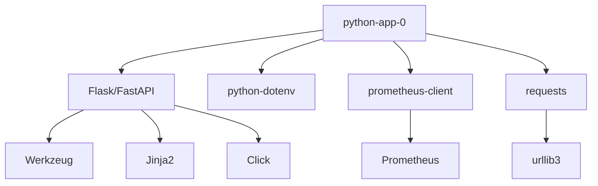

# Dependencies

Overview of external dependencies and service integrations for python-app-0.

## Runtime Dependencies

### Core Libraries

| Package | Version | Purpose |
|---------|---------|---------|
| Flask/FastAPI | 3.0+ | Web framework |
| python-dotenv | 1.0+ | Environment management |
| requests | 2.31+ | HTTP client |
| prometheus-client | 0.19+ | Metrics export |

### Production Requirements
```txt
flask>=3.0.0
python-dotenv>=1.0.0
requests>=2.31.0
prometheus-client>=0.19.0
gunicorn>=21.2.0
```

## Development Dependencies

### Testing

| Package | Version | Purpose |
|---------|---------|---------|
| pytest | 7.4+ | Test framework |
| pytest-cov | 4.1+ | Coverage reporting |
| pytest-mock | 3.12+ | Mocking utilities |

### Code Quality

| Package | Version | Purpose |
|---------|---------|---------|
| black | 23.12+ | Code formatting |
| flake8 | 7.0+ | Linting |
| mypy | 1.8+ | Type checking |
| isort | 5.13+ | Import sorting |

### Development Requirements
```txt
pytest>=7.4.0
pytest-cov>=4.1.0
pytest-mock>=3.12.0
black>=23.12.0
flake8>=7.0.0
mypy>=1.8.0
isort>=5.13.0
pre-commit>=3.6.0
```

## External Services

### Required Services

Currently, this service operates independently with no required external dependencies.

### Optional Services

| Service | Purpose | Status |
|---------|---------|--------|
| Prometheus | Metrics collection | Optional |
| Elasticsearch | Log aggregation | Optional |
| Jaeger | Distributed tracing | Optional |

## Infrastructure Dependencies

### Kubernetes Resources
```yaml
apiVersion: v1
kind: List
items:
  - apiVersion: v1
    kind: ConfigMap
    metadata:
      name: python-app-0-config
  
  - apiVersion: v1
    kind: Secret
    metadata:
      name: python-app-0-secret
  
  - apiVersion: v1
    kind: Service
    metadata:
      name: python-app-0
  
  - apiVersion: apps/v1
    kind: Deployment
    metadata:
      name: python-app-0
  
  - apiVersion: networking.k8s.io/v1
    kind: Ingress
    metadata:
      name: python-app-0
```

### Container Registry

- **Registry**: Container registry URL
- **Image**: `python-app-0:latest`
- **Pull Policy**: IfNotPresent

## Dependency Management

### Installing Dependencies
```bash
# Production dependencies
pip install -r requirements.txt

# Development dependencies
pip install -r requirements-dev.txt

# All dependencies
pip install -r requirements.txt -r requirements-dev.txt
```

### Updating Dependencies
```bash
# Update all packages
pip install --upgrade -r requirements.txt

# Update specific package
pip install --upgrade flask

# Generate updated requirements
pip freeze > requirements.txt
```

### Security Scanning
```bash
# Check for vulnerabilities
pip-audit

# Or using safety
safety check -r requirements.txt
```

## Dependency Graph


## Version Compatibility

### Python Version Support

- **Minimum**: Python 3.11
- **Recommended**: Python 3.11 or 3.12
- **Maximum Tested**: Python 3.12

### Operating System Support

- **Linux**: Ubuntu 22.04+, Debian 11+
- **macOS**: 12.0+ (Monterey)
- **Windows**: WSL2 recommended

## Breaking Changes

### Version 1.0.0

- Initial release
- No breaking changes

## Future Dependencies

Planned additions:

- **Redis**: Session management
- **PostgreSQL**: Data persistence
- **RabbitMQ**: Message queue
- **OpenTelemetry**: Enhanced tracing

## Troubleshooting

### Dependency Conflicts
```bash
# Create fresh virtual environment
python -m venv venv-new
source venv-new/bin/activate

# Install dependencies from scratch
pip install -r requirements.txt
```

### Missing System Dependencies
```bash
# Ubuntu/Debian
sudo apt-get update
sudo apt-get install python3-dev build-essential

# macOS
brew install python@3.11
```

## Next Steps

- [Deployment Configuration](../deployment/configuration.md)
- [Environment Variables](../deployment/environment.md)