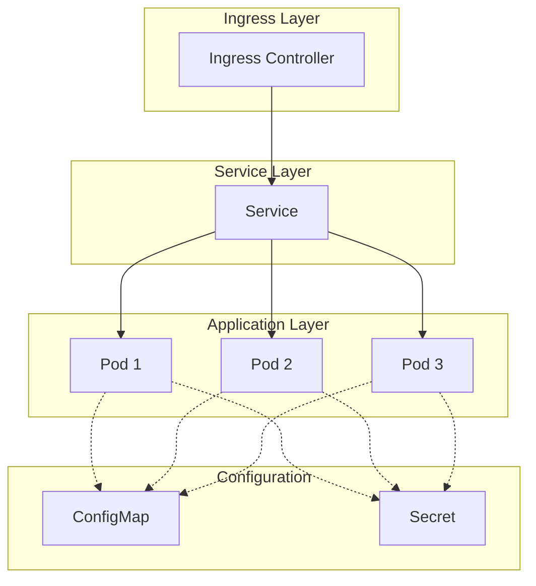

# Kubernetes Deployment

Complete guide for deploying python-app-0 to Kubernetes.

## Prerequisites

- Kubernetes cluster (1.27+)
- kubectl configured
- Helm 3.x (optional)
- Container image built and pushed

## Deployment Architecture


## Kubernetes Manifests

### Namespace
```yaml
apiVersion: v1
kind: Namespace
metadata:
  name: python-app-0
  labels:
    name: python-app-0
    environment: dev
```

### ConfigMap
```yaml
apiVersion: v1
kind: ConfigMap
metadata:
  name: python-app-0-config
  namespace: python-app-0
data:
  APP_ENV: "dev"
  PORT: "8080"
  LOG_LEVEL: "INFO"
```

### Secret
```yaml
apiVersion: v1
kind: Secret
metadata:
  name: python-app-0-secret
  namespace: python-app-0
type: Opaque
data:
  # Base64 encoded values
  API_KEY: <base64-encoded-key>
```

### Deployment
```yaml
apiVersion: apps/v1
kind: Deployment
metadata:
  name: python-app-0
  namespace: python-app-0
  labels:
    app: python-app-0
    version: v1
spec:
  replicas: 3
  strategy:
    type: RollingUpdate
    rollingUpdate:
      maxSurge: 1
      maxUnavailable: 0
  selector:
    matchLabels:
      app: python-app-0
  template:
    metadata:
      labels:
        app: python-app-0
        version: v1
    spec:
      containers:
      - name: python-app-0
        image: your-registry/python-app-0:latest
        imagePullPolicy: Always
        ports:
        - containerPort: 8080
          name: http
        envFrom:
        - configMapRef:
            name: python-app-0-config
        - secretRef:
            name: python-app-0-secret
        resources:
          requests:
            memory: "128Mi"
            cpu: "100m"
          limits:
            memory: "256Mi"
            cpu: "200m"
        livenessProbe:
          httpGet:
            path: /api/v1/healthz
            port: 8080
          initialDelaySeconds: 10
          periodSeconds: 30
          timeoutSeconds: 5
          failureThreshold: 3
        readinessProbe:
          httpGet:
            path: /api/v1/healthz
            port: 8080
          initialDelaySeconds: 5
          periodSeconds: 10
          timeoutSeconds: 3
          failureThreshold: 3
```

### Service
```yaml
apiVersion: v1
kind: Service
metadata:
  name: python-app-0
  namespace: python-app-0
  labels:
    app: python-app-0
spec:
  type: ClusterIP
  ports:
  - port: 80
    targetPort: 8080
    protocol: TCP
    name: http
  selector:
    app: python-app-0
```

### Ingress
```yaml
apiVersion: networking.k8s.io/v1
kind: Ingress
metadata:
  name: python-app-0
  namespace: python-app-0
  annotations:
    kubernetes.io/ingress.class: nginx
    cert-manager.io/cluster-issuer: letsencrypt-prod
    nginx.ingress.kubernetes.io/ssl-redirect: "true"
spec:
  tls:
  - hosts:
    - python-app-0-dev.roofstacks.com
    secretName: python-app-0-tls
  rules:
  - host: python-app-0-dev.roofstacks.com
    http:
      paths:
      - path: /
        pathType: Prefix
        backend:
          service:
            name: python-app-0
            port:
              number: 80
```

## Deployment Steps

### 1. Build and Push Image
```bash
# Build Docker image
docker build -t your-registry/python-app-0:latest .

# Tag with version
docker tag your-registry/python-app-0:latest \
  your-registry/python-app-0:1.0.0

# Push to registry
docker push your-registry/python-app-0:latest
docker push your-registry/python-app-0:1.0.0
```

### 2. Create Namespace
```bash
kubectl create namespace python-app-0
```

### 3. Apply Configuration
```bash
# Apply ConfigMap
kubectl apply -f k8s/configmap.yaml

# Apply Secret
kubectl apply -f k8s/secret.yaml

# Apply Deployment
kubectl apply -f k8s/deployment.yaml

# Apply Service
kubectl apply -f k8s/service.yaml

# Apply Ingress
kubectl apply -f k8s/ingress.yaml
```

### 4. Verify Deployment
```bash
# Check deployment status
kubectl get deployments -n python-app-0

# Check pods
kubectl get pods -n python-app-0

# Check service
kubectl get svc -n python-app-0

# Check ingress
kubectl get ingress -n python-app-0
```

### 5. View Logs
```bash
# View pod logs
kubectl logs -f -l app=python-app-0 -n python-app-0

# View logs from specific pod
kubectl logs -f <pod-name> -n python-app-0
```

## Scaling

### Manual Scaling
```bash
# Scale to 5 replicas
kubectl scale deployment python-app-0 \
  --replicas=5 \
  -n python-app-0
```

### Horizontal Pod Autoscaler
```yaml
apiVersion: autoscaling/v2
kind: HorizontalPodAutoscaler
metadata:
  name: python-app-0-hpa
  namespace: python-app-0
spec:
  scaleTargetRef:
    apiVersion: apps/v1
    kind: Deployment
    name: python-app-0
  minReplicas: 2
  maxReplicas: 10
  metrics:
  - type: Resource
    resource:
      name: cpu
      target:
        type: Utilization
        averageUtilization: 70
  - type: Resource
    resource:
      name: memory
      target:
        type: Utilization
        averageUtilization: 80
```

Apply HPA:
```bash
kubectl apply -f k8s/hpa.yaml
```

## Rolling Updates

### Update Deployment
```bash
# Update image
kubectl set image deployment/python-app-0 \
  python-app-0=your-registry/python-app-0:1.1.0 \
  -n python-app-0

# Watch rollout status
kubectl rollout status deployment/python-app-0 \
  -n python-app-0
```

### Rollback Deployment
```bash
# Rollback to previous version
kubectl rollout undo deployment/python-app-0 \
  -n python-app-0

# Rollback to specific revision
kubectl rollout undo deployment/python-app-0 \
  --to-revision=2 \
  -n python-app-0
```

### View Rollout History
```bash
kubectl rollout history deployment/python-app-0 \
  -n python-app-0
```

## Resource Management

### Resource Quotas
```yaml
apiVersion: v1
kind: ResourceQuota
metadata:
  name: python-app-0-quota
  namespace: python-app-0
spec:
  hard:
    requests.cpu: "4"
    requests.memory: 8Gi
    limits.cpu: "8"
    limits.memory: 16Gi
    pods: "20"
```

### Limit Ranges
```yaml
apiVersion: v1
kind: LimitRange
metadata:
  name: python-app-0-limits
  namespace: python-app-0
spec:
  limits:
  - max:
      cpu: "1"
      memory: 1Gi
    min:
      cpu: "100m"
      memory: 128Mi
    default:
      cpu: "200m"
      memory: 256Mi
    defaultRequest:
      cpu: "100m"
      memory: 128Mi
    type: Container
```

## Network Policies
```yaml
apiVersion: networking.k8s.io/v1
kind: NetworkPolicy
metadata:
  name: python-app-0-netpol
  namespace: python-app-0
spec:
  podSelector:
    matchLabels:
      app: python-app-0
  policyTypes:
  - Ingress
  - Egress
  ingress:
  - from:
    - namespaceSelector:
        matchLabels:
          name: ingress-nginx
    ports:
    - protocol: TCP
      port: 8080
  egress:
  - to:
    - namespaceSelector: {}
    ports:
    - protocol: TCP
      port: 443
  - to:
    - namespaceSelector: {}
    ports:
    - protocol: TCP
      port: 53
    - protocol: UDP
      port: 53
```

## Monitoring Integration

### ServiceMonitor (Prometheus Operator)
```yaml
apiVersion: monitoring.coreos.com/v1
kind: ServiceMonitor
metadata:
  name: python-app-0
  namespace: python-app-0
spec:
  selector:
    matchLabels:
      app: python-app-0
  endpoints:
  - port: http
    path: /metrics
    interval: 30s
```

## Troubleshooting

### Pod Not Starting
```bash
# Describe pod
kubectl describe pod <pod-name> -n python-app-0

# Check events
kubectl get events -n python-app-0 --sort-by='.lastTimestamp'

# Check logs
kubectl logs <pod-name> -n python-app-0 --previous
```

### Service Not Accessible
```bash
# Test service internally
kubectl run -it --rm debug --image=busybox --restart=Never -- \
  wget -qO- http://python-app-0.python-app-0.svc.cluster.local/api/v1/healthz

# Check endpoints
kubectl get endpoints -n python-app-0
```

### Ingress Issues
```bash
# Describe ingress
kubectl describe ingress python-app-0 -n python-app-0

# Check ingress controller logs
kubectl logs -n ingress-nginx -l app.kubernetes.io/name=ingress-nginx
```

## Helm Deployment (Optional)

### Chart Structure
```
helm/
├── Chart.yaml
├── values.yaml
├── values-dev.yaml
├── values-prod.yaml
└── templates/
    ├── deployment.yaml
    ├── service.yaml
    ├── ingress.yaml
    ├── configmap.yaml
    └── secret.yaml
```

### Deploy with Helm
```bash
# Install chart
helm install python-app-0 ./helm \
  -n python-app-0 \
  --create-namespace \
  -f helm/values-dev.yaml

# Upgrade release
helm upgrade python-app-0 ./helm \
  -n python-app-0 \
  -f helm/values-dev.yaml

# Uninstall release
helm uninstall python-app-0 -n python-app-0
```

## Next Steps

- [Configuration Management](configuration.md)
- [Environment Variables](environment.md)
- [Monitoring Setup](../operations/monitoring.md)