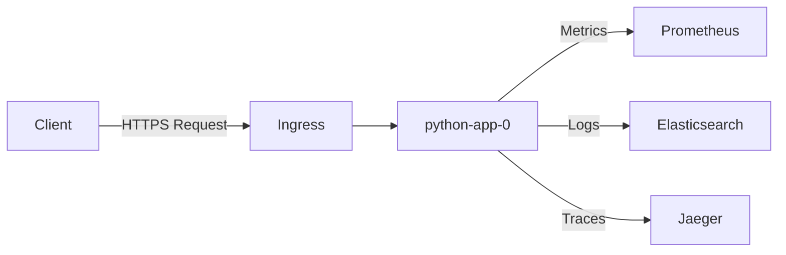

# Getting Started Overview

This guide will help you get started with python-app-0.

## What is python-app-0?

python-app-0 is a lightweight Python microservice designed to provide:

- System information and metadata
- Health check endpoints for monitoring
- Environment-specific configuration

## Architecture Overview

## Technology Stack

| Component | Technology | Purpose |
|-----------|-----------|---------|
| Runtime | Python 3.11+ | Application runtime |
| Framework | Flask/FastAPI | Web framework |
| Container | Docker | Containerization |
| Orchestration | Kubernetes | Container orchestration |
| Monitoring | Prometheus | Metrics collection |
| Logging | ELK Stack | Log aggregation |

## Next Steps

1. [Check Prerequisites](prerequisites.md)
2. [Set up Local Development](local-development.md)
3. [Explore the API](../api/overview.md)