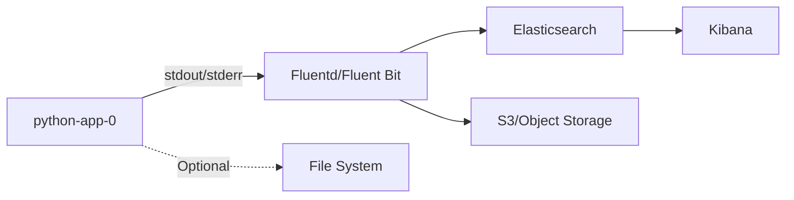

# Logging

Comprehensive logging configuration and best practices for python-app-0.

## Logging Architecture


## Log Format

### Structured JSON Logging
```python
import logging
import json
import sys
from datetime import datetime
import traceback

class JSONFormatter(logging.Formatter):
    """Custom JSON formatter for structured logging"""
    
    def format(self, record):
        log_data = {
            'timestamp': datetime.utcnow().isoformat() + 'Z',
            'level': record.levelname,
            'logger': record.name,
            'message': record.getMessage(),
            'module': record.module,
            'function': record.funcName,
            'line': record.lineno,
        }
        
        # Add exception info if present
        if record.exc_info:
            log_data['exception'] = {
                'type': record.exc_info[0].__name__,
                'message': str(record.exc_info[1]),
                'stacktrace': traceback.format_exception(*record.exc_info)
            }
        
        # Add extra fields
        if hasattr(record, 'request_id'):
            log_data['request_id'] = record.request_id
        if hasattr(record, 'user_id'):
            log_data['user_id'] = record.user_id
        if hasattr(record, 'endpoint'):
            log_data['endpoint'] = record.endpoint
        
        return json.dumps(log_data)

# Configure logging
def setup_logging():
    """Setup application logging"""
    handler = logging.StreamHandler(sys.stdout)
    handler.setFormatter(JSONFormatter())
    
    logger = logging.getLogger()
    logger.addHandler(handler)
    logger.setLevel(logging.INFO)
    
    return logger

logger = setup_logging()
```

### Example Log Output
```json
{
  "timestamp": "2025-12-01T10:30:45.123456Z",
  "level": "INFO",
  "logger": "app.routes",
  "message": "Request processed successfully",
  "module": "routes",
  "function": "info_endpoint",
  "line": 42,
  "request_id": "abc123xyz",
  "endpoint": "/api/v1/info",
  "duration_ms": 15.2,
  "status_code": 200
}
```

## Logging Configuration

### Environment-Based Configuration
```python
import os
import logging

LOG_LEVEL = os.getenv('LOG_LEVEL', 'INFO')
LOG_FORMAT = os.getenv('LOG_FORMAT', 'json')  # json or text

def get_log_level():
    """Get log level from environment"""
    levels = {
        'DEBUG': logging.DEBUG,
        'INFO': logging.INFO,
        'WARNING': logging.WARNING,
        'ERROR': logging.ERROR,
        'CRITICAL': logging.CRITICAL
    }
    return levels.get(LOG_LEVEL.upper(), logging.INFO)

def setup_logging():
    """Configure logging based on environment"""
    level = get_log_level()
    
    if LOG_FORMAT == 'json':
        handler = logging.StreamHandler(sys.stdout)
        handler.setFormatter(JSONFormatter())
    else:
        logging.basicConfig(
            level=level,
            format='%(asctime)s - %(name)s - %(levelname)s - %(message)s',
            stream=sys.stdout
        )
        return logging.getLogger()
    
    logger = logging.getLogger()
    logger.addHandler(handler)
    logger.setLevel(level)
    
    return logger
```

### Flask Integration
```python
from flask import Flask, request, g
import uuid
import time

app = Flask(__name__)
logger = setup_logging()

@app.before_request
def before_request():
    """Add request context to logs"""
    g.start_time = time.time()
    g.request_id = request.headers.get('X-Request-ID', str(uuid.uuid4()))

@app.after_request
def after_request(response):
    """Log request completion"""
    duration = (time.time() - g.start_time) * 1000
    
    logger.info(
        "Request completed",
        extra={
            'request_id': g.request_id,
            'method': request.method,
            'endpoint': request.path,
            'status_code': response.status_code,
            'duration_ms': round(duration, 2),
            'remote_addr': request.remote_addr,
            'user_agent': request.user_agent.string
        }
    )
    
    response.headers['X-Request-ID'] = g.request_id
    return response

@app.route('/api/v1/info')
def info():
    """Info endpoint with logging"""
    logger.info(
        "Info endpoint called",
        extra={
            'request_id': g.request_id,
            'endpoint': '/api/v1/info'
        }
    )
    
    try:
        # Business logic
        result = get_system_info()
        return jsonify(result), 200
    except Exception as e:
        logger.error(
            "Error processing request",
            exc_info=True,
            extra={
                'request_id': g.request_id,
                'endpoint': '/api/v1/info'
            }
        )
        return jsonify({'error': 'Internal server error'}), 500
```

## Log Levels

### Level Guidelines

| Level | Usage | Example |
|-------|-------|---------|
| **DEBUG** | Detailed diagnostic info | Variable values, function calls |
| **INFO** | General informational messages | Request/response, state changes |
| **WARNING** | Warning messages | Deprecated features, retries |
| **ERROR** | Error messages | Handled exceptions, failures |
| **CRITICAL** | Critical failures | System crashes, data corruption |

### Level Examples
```python
# DEBUG - Development details
logger.debug(f"Processing request with params: {params}")

# INFO - Normal operations
logger.info("User authentication successful", extra={'user_id': user.id})

# WARNING - Potential issues
logger.warning("API rate limit approaching threshold", extra={'current': 95})

# ERROR - Recoverable errors
logger.error("Database connection failed, retrying...", exc_info=True)

# CRITICAL - System failures
logger.critical("Unable to start application", exc_info=True)
```

## Kubernetes Logging

### Container Logging
```yaml
apiVersion: apps/v1
kind: Deployment
metadata:
  name: python-app-0
spec:
  template:
    spec:
      containers:
      - name: python-app-0
        env:
        - name: LOG_LEVEL
          value: "INFO"
        - name: LOG_FORMAT
          value: "json"
        # Logs go to stdout/stderr
        # No need for volume mounts in most cases
```

### View Logs
```bash
# View logs from all pods
kubectl logs -l app=python-app-0 -n python-app-0

# Follow logs in real-time
kubectl logs -f -l app=python-app-0 -n python-app-0

# View logs from specific pod
kubectl logs <pod-name> -n python-app-0

# View previous container logs (after restart)
kubectl logs <pod-name> -n python-app-0 --previous

# Tail last 100 lines
kubectl logs <pod-name> -n python-app-0 --tail=100

# Logs since specific time
kubectl logs <pod-name> -n python-app-0 --since=1h
```

## ELK Stack Integration

### Fluentd DaemonSet
```yaml
apiVersion: apps/v1
kind: DaemonSet
metadata:
  name: fluentd
  namespace: kube-system
spec:
  selector:
    matchLabels:
      name: fluentd
  template:
    metadata:
      labels:
        name: fluentd
    spec:
      containers:
      - name: fluentd
        image: fluent/fluentd-kubernetes-daemonset:v1-debian-elasticsearch
        env:
        - name: FLUENT_ELASTICSEARCH_HOST
          value: "elasticsearch.logging.svc.cluster.local"
        - name: FLUENT_ELASTICSEARCH_PORT
          value: "9200"
        volumeMounts:
        - name: varlog
          mountPath: /var/log
        - name: varlibdockercontainers
          mountPath: /var/lib/docker/containers
          readOnly: true
      volumes:
      - name: varlog
        hostPath:
          path: /var/log
      - name: varlibdockercontainers
        hostPath:
          path: /var/lib/docker/containers
```

### Fluentd Configuration
```conf
<source>
  @type tail
  path /var/log/containers/*python-app-0*.log
  pos_file /var/log/fluentd-python-app-0.pos
  tag kubernetes.python-app-0
  <parse>
    @type json
    time_key timestamp
    time_format %Y-%m-%dT%H:%M:%S.%NZ
  </parse>
</source>

<filter kubernetes.python-app-0.**>
  @type parser
  key_name log
  <parse>
    @type json
  </parse>
</filter>

<filter kubernetes.python-app-0.**>
  @type record_transformer
  <record>
    app_name python-app-0
    environment dev
  </record>
</filter>

<match kubernetes.python-app-0.**>
  @type elasticsearch
  host elasticsearch.logging.svc.cluster.local
  port 9200
  index_name python-app-0-%Y.%m.%d
  type_name _doc
  include_tag_key true
  tag_key @log_name
</match>
```

## Kibana Queries

### Useful KQL Queries
```
# All logs for the application
kubernetes.labels.app: "python-app-0"

# Error logs only
level: "ERROR" AND kubernetes.labels.app: "python-app-0"

# Specific endpoint logs
endpoint: "/api/v1/info" AND kubernetes.labels.app: "python-app-0"

# Slow requests (>1 second)
duration_ms: >1000 AND kubernetes.labels.app: "python-app-0"

# Logs from specific time range
@timestamp: [now-1h TO now] AND kubernetes.labels.app: "python-app-0"

# Logs with exceptions
exception.type: * AND kubernetes.labels.app: "python-app-0"

# Logs by request ID
request_id: "abc123xyz"

# 5xx errors
status_code: [500 TO 599] AND kubernetes.labels.app: "python-app-0"
```

### Kibana Index Pattern
```
Index pattern: python-app-0-*
Time field: @timestamp or timestamp
```

## Best Practices

### 1. What to Log

**DO Log:**
- Request/response metadata (method, path, status, duration)
- Authentication/authorization events
- Business logic outcomes
- Errors and exceptions
- Performance metrics
- State changes
- External API calls

**DON'T Log:**
- Passwords or secrets
- Personal Identifiable Information (PII)
- Credit card numbers
- API keys or tokens
- Session tokens
- Full request/response bodies with sensitive data

### 2. Sensitive Data Masking
```python
import re

def mask_sensitive_data(data):
    """Mask sensitive information in logs"""
    if isinstance(data, dict):
        masked = {}
        for key, value in data.items():
            if key.lower() in ['password', 'token', 'secret', 'api_key']:
                masked[key] = '***REDACTED***'
            elif isinstance(value, (dict, list)):
                masked[key] = mask_sensitive_data(value)
            else:
                masked[key] = value
        return masked
    elif isinstance(data, list):
        return [mask_sensitive_data(item) for item in data]
    return data

# Usage
logger.info("User data", extra={'user': mask_sensitive_data(user_data)})
```

### 3. Correlation IDs
```python
import uuid
from flask import request, g

def get_or_generate_request_id():
    """Get request ID from header or generate new one"""
    return request.headers.get('X-Request-ID') or str(uuid.uuid4())

@app.before_request
def set_request_id():
    g.request_id = get_or_generate_request_id()

# Use in all log statements
logger.info("Processing request", extra={'request_id': g.request_id})
```

### 4. Contextual Logging
```python
import logging
from contextvars import ContextVar

# Context variable for request data
request_context = ContextVar('request_context', default={})

class ContextFilter(logging.Filter):
    """Add context to all log records"""
    def filter(self, record):
        context = request_context.get()
        for key, value in context.items():
            setattr(record, key, value)
        return True

# Setup
logger = logging.getLogger()
logger.addFilter(ContextFilter())

# Set context
@app.before_request
def set_context():
    request_context.set({
        'request_id': g.request_id,
        'method': request.method,
        'endpoint': request.path
    })
```

### 5. Log Rotation (File-based)
```python
from logging.handlers import RotatingFileHandler

# Rotating file handler
file_handler = RotatingFileHandler(
    '/var/log/app.log',
    maxBytes=10485760,  # 10MB
    backupCount=10
)
file_handler.setFormatter(JSONFormatter())
logger.addHandler(file_handler)
```

## Performance Considerations

### Async Logging
```python
import logging
from logging.handlers import QueueHandler, QueueListener
from queue import Queue

def setup_async_logging():
    """Setup async logging to avoid blocking"""
    log_queue = Queue(-1)  # No size limit
    
    queue_handler = QueueHandler(log_queue)
    
    stream_handler = logging.StreamHandler(sys.stdout)
    stream_handler.setFormatter(JSONFormatter())
    
    listener = QueueListener(log_queue, stream_handler)
    listener.start()
    
    logger = logging.getLogger()
    logger.addHandler(queue_handler)
    logger.setLevel(logging.INFO)
    
    return logger, listener

logger, listener = setup_async_logging()
```

### Sampling High-Volume Logs
```python
import random

def should_log_sample(sample_rate=0.1):
    """Sample logs based on rate"""
    return random.random() < sample_rate

# Log only 10% of debug messages
if logger.isEnabledFor(logging.DEBUG) and should_log_sample():
    logger.debug("High-frequency debug message")
```

## Troubleshooting

### Logs Not Appearing in Kibana
```bash
# Check if logs are being generated
kubectl logs <pod-name> -n python-app-0

# Check Fluentd status
kubectl logs -n kube-system -l name=fluentd

# Check Elasticsearch indices
curl -X GET "http://elasticsearch:9200/_cat/indices?v"

# Check if index exists
curl -X GET "http://elasticsearch:9200/python-app-0-*/_search?size=1"
```

### High Log Volume
```python
# Reduce log level in production
if os.getenv('APP_ENV') == 'production':
    logger.setLevel(logging.WARNING)
else:
    logger.setLevel(logging.DEBUG)

# Add sampling for high-frequency logs
if should_log_sample(sample_rate=0.01):  # 1%
    logger.debug("Very frequent operation")
```

### JSON Parsing Errors
```python
# Validate JSON before logging
def safe_json_log(logger, message, data):
    """Safely log JSON data"""
    try:
        json.dumps(data)  # Test serialization
        logger.info(message, extra=data)
    except (TypeError, ValueError) as e:
        logger.warning(f"Could not serialize log data: {e}")
        logger.info(message)
```

## Log Retention

### Elasticsearch Index Lifecycle
```json
{
  "policy": {
    "phases": {
      "hot": {
        "actions": {
          "rollover": {
            "max_size": "50GB",
            "max_age": "1d"
          }
        }
      },
      "warm": {
        "min_age": "7d",
        "actions": {
          "shrink": {
            "number_of_shards": 1
          }
        }
      },
      "delete": {
        "min_age": "30d",
        "actions": {
          "delete": {}
        }
      }
    }
  }
}
```

### Curator for Index Management
```yaml
# curator-config.yml
actions:
  1:
    action: delete_indices
    description: Delete logs older than 30 days
    options:
      ignore_empty_list: True
    filters:
    - filtertype: pattern
      kind: prefix
      value: python-app-0-
    - filtertype: age
      source: name
      direction: older
      timestring: '%Y.%m.%d'
      unit: days
      unit_count: 30
```

## Monitoring Logs

### Log-Based Metrics
```yaml
# Prometheus alert based on logs
- alert: HighErrorLogRate
  expr: |
    sum(rate(fluentd_output_status_num_records_total{
      tag=~"kubernetes.python-app-0.*",
      level="ERROR"
    }[5m])) > 10
  for: 5m
  annotations:
    summary: High error log rate detected
```

## Next Steps

- [Monitoring Setup](monitoring.md)
- [Troubleshooting Guide](troubleshooting.md)
- [Alert Configuration](monitoring.md#alerting)