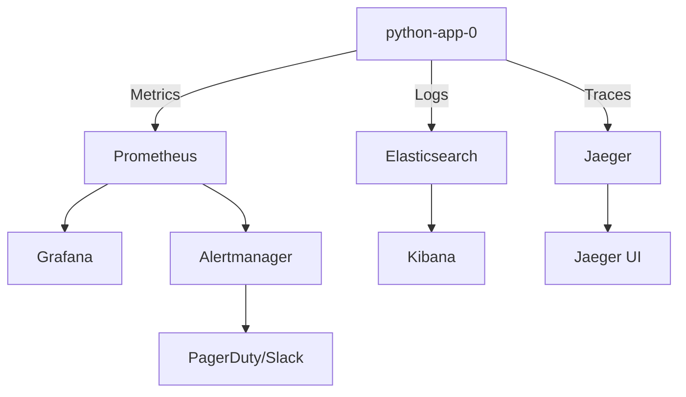

# Monitoring

Complete monitoring setup and best practices for python-app-0.

## Monitoring Stack Overview


## Metrics Collection

### Prometheus Integration

#### Application Metrics Endpoint
```python
from prometheus_client import Counter, Histogram, Gauge, generate_latest
from flask import Response
import time

# Define metrics
request_count = Counter(
    'http_requests_total',
    'Total HTTP requests',
    ['method', 'endpoint', 'status']
)

request_duration = Histogram(
    'http_request_duration_seconds',
    'HTTP request duration',
    ['method', 'endpoint']
)

active_requests = Gauge(
    'http_requests_active',
    'Active HTTP requests'
)

# Metrics endpoint
@app.route('/metrics')
def metrics():
    return Response(generate_latest(), mimetype='text/plain')

# Middleware to track metrics
@app.before_request
def before_request():
    request.start_time = time.time()
    active_requests.inc()

@app.after_request
def after_request(response):
    request_duration.labels(
        method=request.method,
        endpoint=request.endpoint
    ).observe(time.time() - request.start_time)
    
    request_count.labels(
        method=request.method,
        endpoint=request.endpoint,
        status=response.status_code
    ).inc()
    
    active_requests.dec()
    return response
```

#### ServiceMonitor Configuration
```yaml
apiVersion: monitoring.coreos.com/v1
kind: ServiceMonitor
metadata:
  name: python-app-0
  namespace: python-app-0
  labels:
    app: python-app-0
    release: prometheus
spec:
  selector:
    matchLabels:
      app: python-app-0
  endpoints:
  - port: http
    path: /metrics
    interval: 30s
    scrapeTimeout: 10s
```

### Key Metrics to Monitor

#### Application Metrics

| Metric | Type | Description |
|--------|------|-------------|
| `http_requests_total` | Counter | Total number of HTTP requests |
| `http_request_duration_seconds` | Histogram | Request processing time |
| `http_requests_active` | Gauge | Currently active requests |
| `http_request_size_bytes` | Histogram | Request payload size |
| `http_response_size_bytes` | Histogram | Response payload size |

#### System Metrics

| Metric | Type | Description |
|--------|------|-------------|
| `process_cpu_seconds_total` | Counter | CPU time consumed |
| `process_resident_memory_bytes` | Gauge | Resident memory size |
| `process_open_fds` | Gauge | Open file descriptors |
| `python_gc_objects_collected_total` | Counter | Objects collected during GC |

#### Business Metrics
```python
from prometheus_client import Counter

# Custom business metrics
info_requests = Counter(
    'app_info_requests_total',
    'Total info endpoint requests'
)

health_checks = Counter(
    'app_health_checks_total',
    'Total health check requests',
    ['status']
)

@app.route('/api/v1/info')
def info():
    info_requests.inc()
    # ... endpoint logic

@app.route('/api/v1/healthz')
def health():
    status = check_health()
    health_checks.labels(status=status).inc()
    # ... endpoint logic
```

## Prometheus Configuration

### Prometheus Server Config
```yaml
# prometheus-config.yaml
global:
  scrape_interval: 30s
  evaluation_interval: 30s
  external_labels:
    cluster: roofstacks
    environment: dev

scrape_configs:
  - job_name: 'python-app-0'
    kubernetes_sd_configs:
    - role: pod
      namespaces:
        names:
        - python-app-0
    relabel_configs:
    - source_labels: [__meta_kubernetes_pod_label_app]
      action: keep
      regex: python-app-0
    - source_labels: [__meta_kubernetes_pod_name]
      target_label: pod
    - source_labels: [__meta_kubernetes_namespace]
      target_label: namespace
```

### Recording Rules
```yaml
# prometheus-rules.yaml
apiVersion: monitoring.coreos.com/v1
kind: PrometheusRule
metadata:
  name: python-app-0-rules
  namespace: python-app-0
spec:
  groups:
  - name: python-app-0
    interval: 30s
    rules:
    # Request rate
    - record: job:http_requests:rate5m
      expr: |
        sum(rate(http_requests_total{job="python-app-0"}[5m]))
        by (job, method, status)
    
    # Error rate
    - record: job:http_requests:error_rate5m
      expr: |
        sum(rate(http_requests_total{job="python-app-0",status=~"5.."}[5m]))
        /
        sum(rate(http_requests_total{job="python-app-0"}[5m]))
    
    # Request duration p95
    - record: job:http_request_duration:p95
      expr: |
        histogram_quantile(0.95,
          sum(rate(http_request_duration_seconds_bucket{job="python-app-0"}[5m]))
          by (job, method, endpoint, le)
        )
    
    # Request duration p99
    - record: job:http_request_duration:p99
      expr: |
        histogram_quantile(0.99,
          sum(rate(http_request_duration_seconds_bucket{job="python-app-0"}[5m]))
          by (job, method, endpoint, le)
        )
```

## Alerting

### Alert Rules
```yaml
# prometheus-alerts.yaml
apiVersion: monitoring.coreos.com/v1
kind: PrometheusRule
metadata:
  name: python-app-0-alerts
  namespace: python-app-0
spec:
  groups:
  - name: python-app-0_alerts
    interval: 30s
    rules:
    # High error rate
    - alert: HighErrorRate
      expr: |
        job:http_requests:error_rate5m{job="python-app-0"} > 0.05
      for: 5m
      labels:
        severity: critical
        service: python-app-0
      annotations:
        summary: "High error rate detected"
        description: "Error rate is {{ $value | humanizePercentage }} for {{ $labels.job }}"
    
    # Slow response time
    - alert: SlowResponseTime
      expr: |
        job:http_request_duration:p95{job="python-app-0"} > 1
      for: 10m
      labels:
        severity: warning
        service: python-app-0
      annotations:
        summary: "Slow response time detected"
        description: "P95 latency is {{ $value }}s for {{ $labels.job }}"
    
    # Service down
    - alert: ServiceDown
      expr: |
        up{job="python-app-0"} == 0
      for: 2m
      labels:
        severity: critical
        service: python-app-0
      annotations:
        summary: "Service is down"
        description: "{{ $labels.job }} has been down for more than 2 minutes"
    
    # High memory usage
    - alert: HighMemoryUsage
      expr: |
        process_resident_memory_bytes{job="python-app-0"} / 1024 / 1024 > 200
      for: 5m
      labels:
        severity: warning
        service: python-app-0
      annotations:
        summary: "High memory usage"
        description: "Memory usage is {{ $value }}MB for {{ $labels.pod }}"
    
    # Pod restart
    - alert: PodRestarting
      expr: |
        rate(kube_pod_container_status_restarts_total{namespace="python-app-0"}[15m]) > 0
      for: 5m
      labels:
        severity: warning
        service: python-app-0
      annotations:
        summary: "Pod is restarting"
        description: "Pod {{ $labels.pod }} has restarted {{ $value }} times"
```

### Alertmanager Configuration
```yaml
# alertmanager-config.yaml
apiVersion: v1
kind: ConfigMap
metadata:
  name: alertmanager-config
  namespace: monitoring
data:
  alertmanager.yml: |
    global:
      resolve_timeout: 5m
    
    route:
      group_by: ['alertname', 'service']
      group_wait: 10s
      group_interval: 10s
      repeat_interval: 12h
      receiver: 'team-slack'
      
      routes:
      - match:
          severity: critical
        receiver: 'pagerduty'
        continue: true
      
      - match:
          severity: warning
        receiver: 'team-slack'
    
    receivers:
    - name: 'team-slack'
      slack_configs:
      - api_url: 'https://hooks.slack.com/services/YOUR/SLACK/WEBHOOK'
        channel: '#python-app-0-alerts'
        title: '{{ .GroupLabels.alertname }}'
        text: '{{ range .Alerts }}{{ .Annotations.description }}{{ end }}'
    
    - name: 'pagerduty'
      pagerduty_configs:
      - service_key: 'YOUR_PAGERDUTY_KEY'
        description: '{{ .GroupLabels.alertname }}'
```

## Grafana Dashboards

### Dashboard JSON
```json
{
  "dashboard": {
    "title": "python-app-0 Overview",
    "tags": ["python-app-0", "dev"],
    "timezone": "browser",
    "panels": [
      {
        "title": "Request Rate",
        "targets": [
          {
            "expr": "sum(rate(http_requests_total{job=\"python-app-0\"}[5m]))",
            "legendFormat": "Total Requests/s"
          }
        ],
        "type": "graph"
      },
      {
        "title": "Error Rate",
        "targets": [
          {
            "expr": "sum(rate(http_requests_total{job=\"python-app-0\",status=~\"5..\"}[5m])) / sum(rate(http_requests_total{job=\"python-app-0\"}[5m]))",
            "legendFormat": "Error Rate"
          }
        ],
        "type": "graph"
      },
      {
        "title": "Response Time (P95)",
        "targets": [
          {
            "expr": "histogram_quantile(0.95, sum(rate(http_request_duration_seconds_bucket{job=\"python-app-0\"}[5m])) by (le))",
            "legendFormat": "P95 Latency"
          }
        ],
        "type": "graph"
      },
      {
        "title": "Active Requests",
        "targets": [
          {
            "expr": "http_requests_active{job=\"python-app-0\"}",
            "legendFormat": "{{ pod }}"
          }
        ],
        "type": "graph"
      }
    ]
  }
}
```

### ConfigMap for Dashboard
```yaml
apiVersion: v1
kind: ConfigMap
metadata:
  name: python-app-0-dashboard
  namespace: monitoring
  labels:
    grafana_dashboard: "1"
data:
  python-app-0.json: |
    {
      "dashboard": {
        # ... dashboard JSON
      }
    }
```

## Key Performance Indicators (KPIs)

### SLI/SLO Definitions

| Indicator | Target | Measurement |
|-----------|--------|-------------|
| **Availability** | 99.9% | `up{job="python-app-0"}` |
| **Error Rate** | < 1% | Error rate < 0.01 |
| **Latency (P95)** | < 500ms | P95 < 0.5s |
| **Latency (P99)** | < 1s | P99 < 1s |
| **Throughput** | > 100 req/s | Request rate monitoring |

### SLO Monitoring Query
```promql
# Availability SLO (99.9%)
1 - (
  sum(rate(http_requests_total{job="python-app-0",status=~"5.."}[30d]))
  /
  sum(rate(http_requests_total{job="python-app-0"}[30d]))
) >= 0.999

# Latency SLO (P95 < 500ms)
histogram_quantile(0.95,
  sum(rate(http_request_duration_seconds_bucket{job="python-app-0"}[5m]))
  by (le)
) < 0.5
```

## Health Checks Monitoring

### Blackbox Exporter
```yaml
apiVersion: v1
kind: ConfigMap
metadata:
  name: blackbox-exporter-config
  namespace: monitoring
data:
  blackbox.yml: |
    modules:
      http_2xx:
        prober: http
        timeout: 5s
        http:
          valid_status_codes: [200]
          method: GET
          preferred_ip_protocol: "ip4"
```

### Probe Configuration
```yaml
apiVersion: monitoring.coreos.com/v1
kind: Probe
metadata:
  name: python-app-0-probe
  namespace: monitoring
spec:
  prober:
    url: blackbox-exporter:9115
  module: http_2xx
  targets:
    staticConfig:
      static:
      - https://python-app-0-dev.roofstacks.com/api/v1/healthz
  interval: 30s
  scrapeTimeout: 10s
```

## Useful Queries

### Request Patterns
```promql
# Total requests per minute
sum(rate(http_requests_total{job="python-app-0"}[1m])) * 60

# Requests by endpoint
sum(rate(http_requests_total{job="python-app-0"}[5m])) by (endpoint)

# Requests by status code
sum(rate(http_requests_total{job="python-app-0"}[5m])) by (status)

# 4xx vs 5xx errors
sum(rate(http_requests_total{job="python-app-0",status=~"4.."}[5m]))
sum(rate(http_requests_total{job="python-app-0",status=~"5.."}[5m]))
```

### Performance Queries
```promql
# Average response time
rate(http_request_duration_seconds_sum{job="python-app-0"}[5m])
/
rate(http_request_duration_seconds_count{job="python-app-0"}[5m])

# Request duration percentiles
histogram_quantile(0.50, sum(rate(http_request_duration_seconds_bucket[5m])) by (le))  # P50
histogram_quantile(0.95, sum(rate(http_request_duration_seconds_bucket[5m])) by (le))  # P95
histogram_quantile(0.99, sum(rate(http_request_duration_seconds_bucket[5m])) by (le))  # P99

# Slowest endpoints
topk(5,
  histogram_quantile(0.95,
    sum(rate(http_request_duration_seconds_bucket{job="python-app-0"}[5m]))
    by (endpoint, le)
  )
)
```

### Resource Usage
```promql
# Memory usage
process_resident_memory_bytes{job="python-app-0"} / 1024 / 1024

# CPU usage
rate(process_cpu_seconds_total{job="python-app-0"}[5m])

# Pod memory usage (from cAdvisor)
sum(container_memory_usage_bytes{namespace="python-app-0"}) by (pod)

# Pod CPU usage
sum(rate(container_cpu_usage_seconds_total{namespace="python-app-0"}[5m])) by (pod)
```

### Capacity Planning
```promql
# Request rate trend (24h)
sum(rate(http_requests_total{job="python-app-0"}[24h]))

# Peak request rate
max_over_time(sum(rate(http_requests_total{job="python-app-0"}[5m]))[1d:5m])

# Resource saturation
container_memory_usage_bytes / container_spec_memory_limit_bytes
```

## Best Practices

### 1. Metric Naming

Follow Prometheus naming conventions:
```
<namespace>_<subsystem>_<name>_<unit>

Examples:
http_requests_total
http_request_duration_seconds
process_resident_memory_bytes
```

### 2. Label Usage
```python
# Good - Low cardinality
request_count.labels(
    method="GET",
    endpoint="/api/v1/info",
    status=200
)

# Bad - High cardinality (avoid user IDs, timestamps, etc.)
request_count.labels(
    user_id="12345",  # Don't do this!
    timestamp="2025-12-01"  # Don't do this!
)
```

### 3. Metric Types

- **Counter**: Monotonically increasing (requests, errors)
- **Gauge**: Can go up and down (memory, active connections)
- **Histogram**: Distributions (latency, request size)
- **Summary**: Similar to histogram, client-side quantiles

### 4. Scrape Intervals

- Production: 30s
- Development: 60s
- Long-term storage: Use recording rules

## Troubleshooting

### Metrics Not Appearing
```bash
# Check if /metrics endpoint is accessible
curl http://python-app-0.${namespace}.svc.cluster.local/metrics

# Check ServiceMonitor
kubectl get servicemonitor python-app-0 -n python-app-0

# Check Prometheus targets
kubectl port-forward -n monitoring svc/prometheus 9090:9090
# Visit http://localhost:9090/targets
```

### High Cardinality Issues
```promql
# Find metrics with high cardinality
topk(10, count by (__name__)({__name__=~".+"}))

# Check label cardinality
count by (__name__, job)(rate(http_requests_total[5m]))
```

### Missing Data Points
```bash
# Check scrape success rate
up{job="python-app-0"}

# Check scrape duration
scrape_duration_seconds{job="python-app-0"}

# View Prometheus logs
kubectl logs -n monitoring -l app=prometheus
```

## Next Steps

- [Logging Configuration](logging.md)
- [Troubleshooting Guide](troubleshooting.md)
- [Alert Runbooks](troubleshooting.md#alert-runbooks)