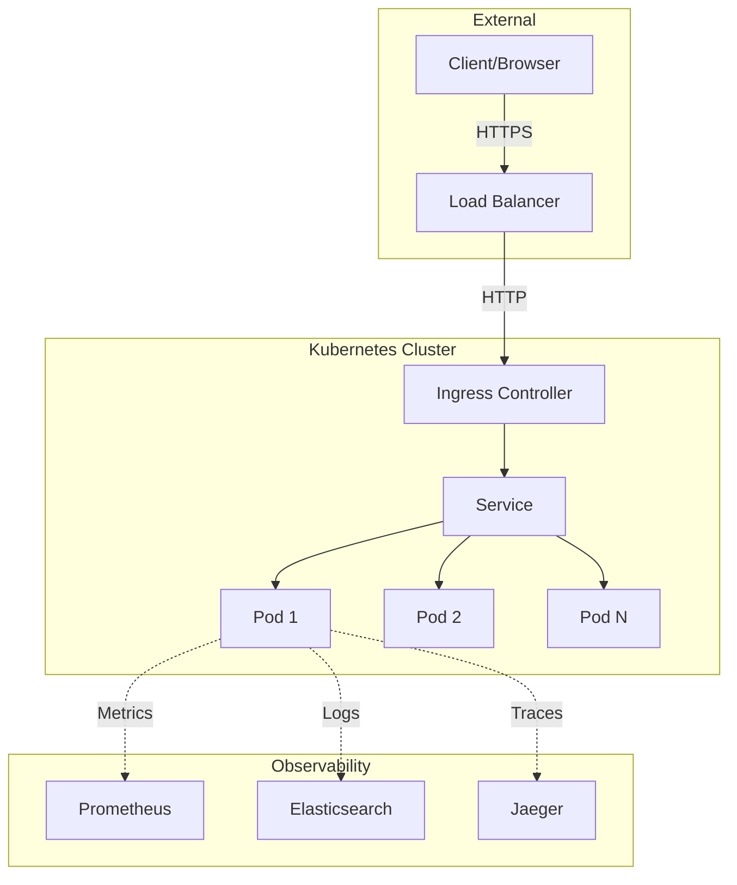
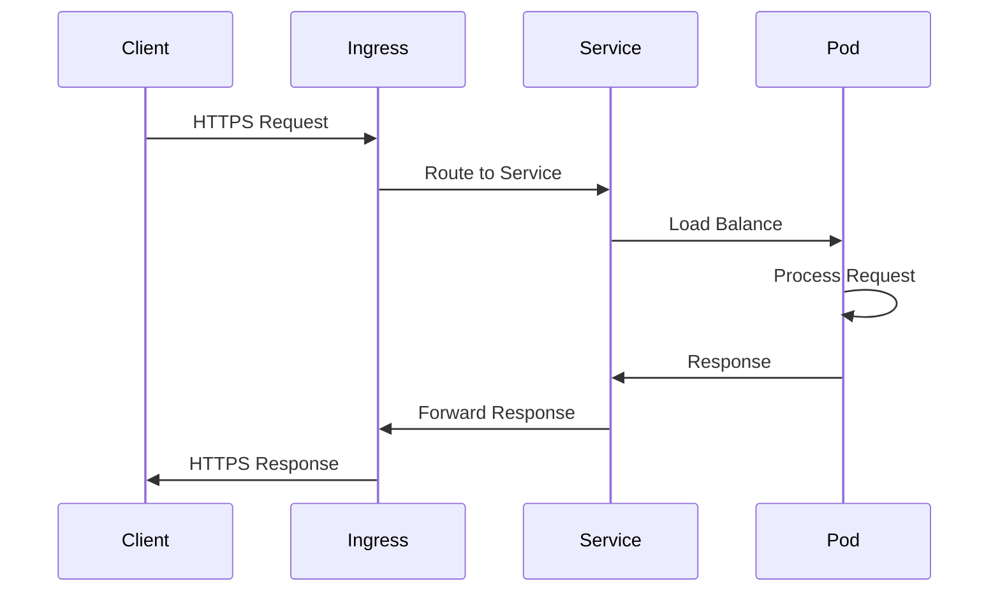

# System Design

Architecture and design patterns used in python-app-0.

## High-Level Architecture


## Component Design

### Application Layer

**API Endpoints**

- RESTful design principles
- Versioned API (`/api/v1/`)
- JSON responses
- HTTP status codes

**Request Flow:**


### Service Layer

**Responsibilities:**

- Business logic
- Request validation
- Response formatting
- Error handling

### Infrastructure Layer

**Kubernetes Resources:**

- **Deployment**: Manages replicas
- **Service**: Internal networking
- **Ingress**: External access
- **ConfigMap**: Configuration
- **Secret**: Sensitive data

## Design Patterns

### 12-Factor App Principles

1. **Codebase**: Single repo, multiple deploys
2. **Dependencies**: Explicit declaration
3. **Config**: Environment-based
4. **Backing Services**: Attached resources
5. **Build, Release, Run**: Separate stages
6. **Processes**: Stateless execution
7. **Port Binding**: Self-contained
8. **Concurrency**: Horizontal scaling
9. **Disposability**: Fast startup/shutdown
10. **Dev/Prod Parity**: Keep environments similar
11. **Logs**: Treat as event streams
12. **Admin Processes**: One-off tasks

### Error Handling
```python
@app.errorhandler(404)
def not_found(error):
    return jsonify({
        "error": "Not Found",
        "message": "The requested resource was not found"
    }), 404

@app.errorhandler(500)
def internal_error(error):
    return jsonify({
        "error": "Internal Server Error",
        "message": "An unexpected error occurred"
    }), 500
```

## Scalability

### Horizontal Scaling
```yaml
apiVersion: autoscaling/v2
kind: HorizontalPodAutoscaler
metadata:
  name: python-app-0-hpa
spec:
  scaleTargetRef:
    apiVersion: apps/v1
    kind: Deployment
    name: python-app-0
  minReplicas: 2
  maxReplicas: 10
  metrics:
  - type: Resource
    resource:
      name: cpu
      target:
        type: Utilization
        averageUtilization: 70
```

### Load Balancing

- Round-robin distribution
- Session affinity (if needed)
- Health-based routing

## Security Considerations

- HTTPS only
- No sensitive data in logs
- Secure environment variables
- Regular security updates
- Network policies

## Next Steps

- [Dependencies](dependencies.md)
- [Deployment Guide](../deployment/kubernetes.md)